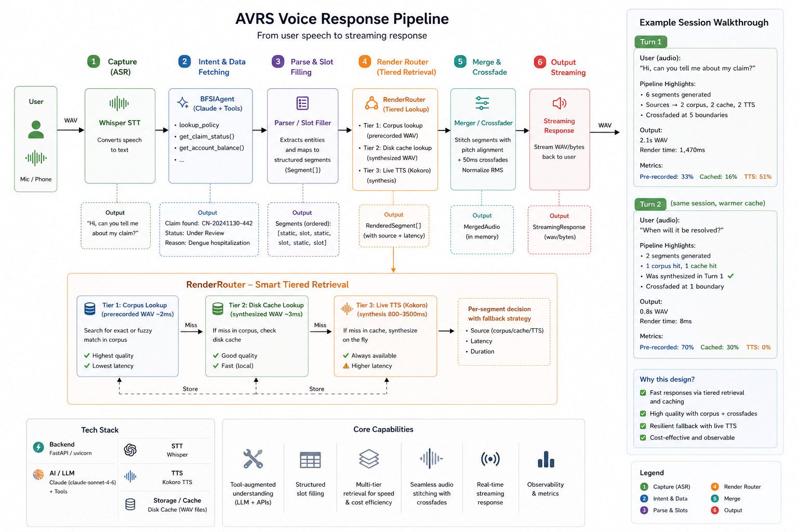
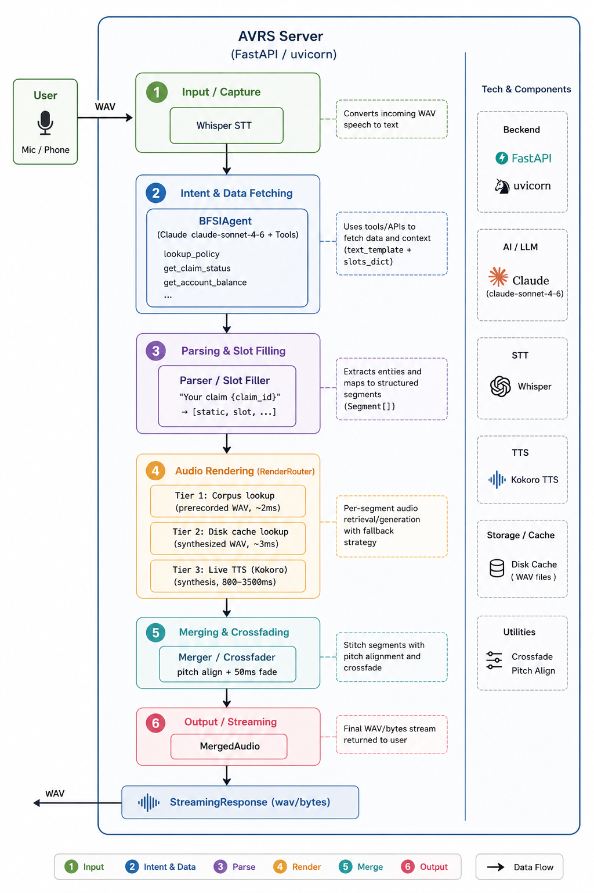
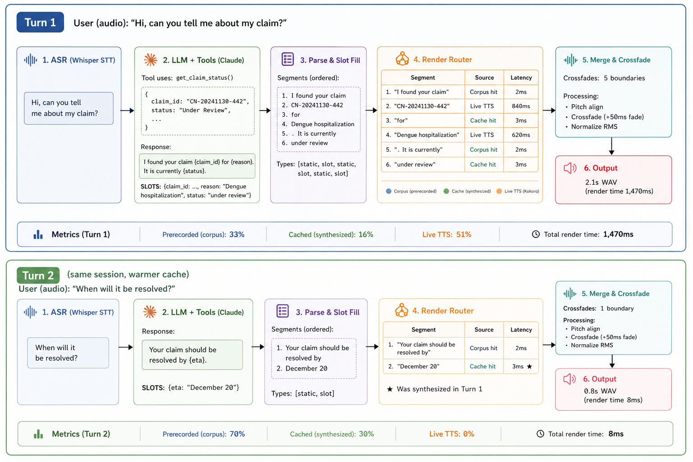

# AVRS - Adaptive Voice Rendering System

> Real-time hybrid audio rendering that makes voice AI agents fast, cheap, and seamless.

**Author:** Supreeth Ravi &nbsp;|&nbsp; **Version:** 0.1.0

---

## What is AVRS?

AVRS is a new way of thinking about how voice AI agents speak.

Right now, when a voice agent says something like:

> *"Your claim CN-20241130-442 is currently under review, and you can expect a resolution by December 20th."*

Every single word in that sentence is synthesised from scratch using a Text-to-Speech API. Real time. Every turn. Every caller. That costs money per character and takes 1-3 seconds.

AVRS asks a different question: **why synthesise the same phrases thousands of times a day?**

Phrases like *"Your claim is under review"* or *"How may I assist you today?"* are spoken on every call. Only a tiny fraction of each response is truly unique - the claim number, the date, the amount. AVRS prerecords the static parts once, synthesises only the dynamic values, and stitches everything together into seamless audio.

Same voice. Same quality. A fraction of the cost. Dramatically lower latency.

---

## The Problem with Standard Voice AI

The typical voice AI pipeline looks like this:

```
User speaks -> STT -> LLM generates full response -> TTS synthesises everything -> Agent speaks
```

It works. But at scale, three costs compound hard.

### 1. TTS is expensive per character

Commercial TTS APIs charge around $0.30 per 1,000 characters. A contact center running 100,000 calls per day at 6 turns per call generates roughly 36 million TTS characters daily. That is around $10,800 per day, or $3.9M per year, in TTS alone - before LLM inference costs.

### 2. LLM generates everything from scratch every turn

The model writes a fresh 150-200 token response for every single turn. At scale, that is the dominant inference cost. Most of what it generates is boilerplate that was already said on the last thousand calls.

### 3. Latency stacks up

STT + LLM generation + TTS synthesis = 2 to 5 seconds before the caller hears anything. Human conversation has gaps under 200ms. At 3 seconds, an AI voice agent sounds slow and unnatural regardless of how good the content is.

---

## The AVRS Approach

AVRS introduces a paradigm called **deterministic templates with dynamic slot infilling**.

Instead of asking the LLM to write a full sentence, it produces a template with named placeholders plus a dictionary of values to fill them:

```
LLM output:
  "Your claim {claim_id} is {status}. Resolution by {eta}."
  SLOTS: {"claim_id": "CN-20241130-442", "status": "under review", "eta": "December 20"}
```

The template is split into segments. Static segments are served from a prerecorded corpus or session cache. Only the slot values ever touch live TTS.

### How it fixes all three problems

| Problem | Without AVRS | With AVRS |
|---|---|---|
| TTS cost | 100% of characters synthesised every turn | 15-85% of characters never touch TTS |
| LLM tokens | 150-200 output tokens per turn | ~50 tokens (template + JSON slots) |
| Latency | 2,000-5,000ms cold start | 8ms warm, ~850ms mixed |

---

## Full Pipeline



The pipeline shows the complete flow from user speech to rendered audio. On the right, the RenderRouter detail shows how each segment is independently resolved through the three tiers. The bottom section shows real metrics from a two-turn conversation: Turn 1 at 1,470ms with a mix of corpus, cache, and live TTS; Turn 2 at 8ms with zero live TTS.

---

## Three-Tier Audio Routing

Every segment in a response is resolved through a priority-ordered chain. Cheapest and fastest source wins:

**Tier 1 - Corpus (~2ms).** Fuzzy match against a library of prerecorded phrases. Human-recorded or pre-synthesised offline. Zero marginal cost per call.

**Tier 2 - Session cache (~3ms).** Was this exact segment synthesised in a previous turn? Serve it from disk instantly. Cache is shared across all callers in a session.

**Tier 3 - Live TTS (200-840ms).** Novel text. Synthesised locally with Kokoro ONNX - no API, no per-character cost, no GPU needed. Result is written to cache for instant reuse next time.

After all segments render, the Merger stitches them together with pitch alignment and 50ms crossfades so the output sounds like one continuous utterance.

---

## Server Architecture



The architecture shows the full server component breakdown - from WAV input through STT, the LLM agent with tool use, the parser and slot filler, the three-tier audio renderer, the merger, and finally the streaming response back to the caller. The right panel shows the tech stack for each component.

| Component | Technology |
|---|---|
| API server | FastAPI + uvicorn |
| STT | Deepgram nova-2 (cloud) / faster-whisper (offline) |
| LLM | Claude with tool use (model configurable via env) |
| TTS | Kokoro ONNX - 82M params, CPU only, no GPU |
| Audio processing | librosa, soundfile, numpy/scipy |
| Corpus lookup | In-memory fuzzy match (difflib, threshold 0.68) |
| Cache | Local disk, SHA256-keyed WAV files |

---

## Turn-by-Turn Example



This shows two consecutive turns from a real conversation.

**Turn 1 (cold session):** User asks about their claim. Claude calls `get_claim_status()`, gets the data, and produces a 6-segment response. Three segments hit the corpus or cache (~2-3ms each). Two novel values (the claim ID and the reason) go to live TTS (~840ms and ~620ms). Total: 1,470ms. Metrics: 33% prerecorded, 16% cached, 51% live TTS.

**Turn 2 (warm cache):** User asks when it will be resolved. Claude responds with two segments. The static phrase hits the corpus. "December 20" was synthesised in Turn 1 and is now in cache. Total: **8ms**. Metrics: 70% prerecorded, 30% cached, 0% live TTS.

This is the cache warmth effect - values synthesised in one turn are instantly available in the next.

---

## Measured Results

From a 7-turn insurance conversation benchmark:

| Turn | Prerecorded | Cached | Live TTS | Total render time |
|---|---|---|---|---|
| Turn 1 - cold session | 33% | 16% | 51% | 1,470ms |
| Turn 2 - warm cache | 70% | 30% | 0% | 8ms |
| Best single question | 75% | 0% | 25% | 7ms |

### Cost at scale (100,000 calls/day, 75% hit rate at steady state)

| | Without AVRS | With AVRS | Saving |
|---|---|---|---|
| TTS cost/day | $10,800 | $2,700 | $8,100 |
| TTS cost/year | $3.94M | $985K | ~$3M |
| LLM inference/day | $360 | $90 | $270 |
| P50 response latency | 2,000ms | 8-850ms | 10-250x faster |

At 1M calls/day: around $30M/year in savings.

---

## Why This Matters Beyond Cost

**Latency is naturalness.** Human conversation has response gaps under 200ms. At 2-5 seconds, AI voice agents feel robotic regardless of content quality. At 8ms on warm turns, the gap effectively disappears.

**Runs fully offline.** Kokoro ONNX runs on CPU with no GPU, no API, no internet required after setup. STT, LLM, and TTS can all run on a single server with zero external dependencies.

**Regulatory alignment.** In insurance, banking, and healthcare, certain disclosure phrases must be spoken verbatim. A generative model can paraphrase - a prerecorded corpus cannot. Every AVRS response is a deterministic function of `(template_id, slot_values)`, giving you a complete audit trail.

**Cache compounds automatically.** Every phrase synthesised for one caller is instantly available for the next. At production volume, hit rates stabilise at 75-85% within days - no manual work needed.

---

## Agent Personas

Three voice agent personas ship out of the box. All config lives in `agents.yaml` - change names, prompts, greetings, or add new personas without touching any code.

| ID | Name | Domain |
|---|---|---|
| `insurance` | Priya | Health and motor insurance |
| `banking` | Arjun | Savings accounts, loans, cards, UPI |
| `payments` | Maya | Digital payments and refunds |

---

## Getting Started

### Option A - Docker (recommended)

Five commands and you are running:

```bash
# Clone and build the image
git clone <repo-url> && cd avrs
docker compose build

# Set your API key
cp .env.example .env
# edit .env - add ANTHROPIC_API_KEY at minimum

# Download Kokoro model files (~337MB, one time only)
docker compose run --rm avrs download-models

# Build the prerecorded phrase corpus (one time only)
docker compose run --rm avrs build-corpus

# Start the server
docker compose up
```

Open `http://localhost:8001` - the browser demo is ready.

### Option B - Local Python

```bash
git clone <repo-url> && cd avrs
python3 -m venv .venv && source .venv/bin/activate
pip install -e ".[kokoro]"
python -m spacy download en_core_web_sm

# Download Kokoro model files from:
# https://github.com/thewh1teagle/kokoro-onnx/releases
# Place kokoro-v1.0.onnx and voices-v1.0.bin in models/kokoro/

cp .env.example .env   # add ANTHROPIC_API_KEY

python scripts/build_insurance_corpus.py
uvicorn avrs.voice_api:app --host 0.0.0.0 --port 8001 --reload
```

### No models? Use mock mode

Want to explore the API and agent logic without downloading anything:

```bash
AVRS_TTS_MODEL=mock   # in .env
```

Full routing, parsing, and LLM agent runs normally. TTS output is silent placeholders.

---

## Quick API Test

```bash
# Start a session
curl -X POST http://localhost:8001/v1/agent/sessions \
  -H "Content-Type: application/json" \
  -d '{"agent": "insurance", "model": "kokoro"}'
# Returns: {"session_id": "sess_abc123"}

# Ask a question - get back a WAV file
curl -X POST "http://localhost:8001/v1/agent/sessions/sess_abc123/turn?text=What+is+my+claim+status" \
  --output response.wav

# Routing breakdown is in the response headers:
# X-AVRS-Metrics: {"prerecorded_pct": 50, "cached_pct": 25, "tts_chars_pct": 25, "latency_total_ms": 480}
```

The browser frontend at `http://localhost:8001` gives you a full voice UI with real-time routing breakdown per turn.

---

## Benchmarking

```bash
# Server must be running
python scripts/find_best_questions.py
```

Sweeps 22 candidate questions independently, ranks by corpus score (`prerecorded% + cached% x 0.5`), then runs a real 7-turn conversation with the top 7. Shows routing percentages and latencies per turn so you can see exactly which questions benefit most from the corpus.

---

## Project Structure

```
avrs/
├── agents.yaml                      # Persona config - edit this, not code
├── .env.example                     # Copy to .env and fill in keys
├── Dockerfile
├── docker-compose.yml
├── docker-entrypoint.sh             # download-models / build-corpus / serve
│
├── avrs/
│   ├── agent.py                     # LLM agent - Claude + agentic tool loop
│   ├── parser.py                    # Split response into static/slot segments
│   ├── corpus.py                    # Fuzzy phrase lookup
│   ├── router.py                    # Three-tier routing
│   ├── tts.py                       # Kokoro ONNX / mock TTS engines
│   ├── stt.py                       # Deepgram / Whisper STT
│   ├── merger.py                    # Crossfade + pitch align + normalise
│   ├── metrics.py                   # Per-turn cost / latency breakdown
│   ├── server.py                    # FastAPI app
│   └── voice_api.py                 # REST + WebSocket handlers
│
├── scripts/
│   ├── download_models.sh           # Fetch Kokoro ONNX files
│   ├── build_insurance_corpus.py    # Build prerecorded phrase library
│   └── find_best_questions.py       # Corpus hit rate benchmark
│
├── docs/images/                     # Architecture and example diagrams
├── corpus_data/                     # Source phrase text files
├── corpus/                          # Generated audio corpus (git-ignored)
├── cache/                           # Runtime synthesis cache (git-ignored)
├── models/kokoro/                   # Kokoro model files (git-ignored, ~337MB)
├── static/index.html                # Browser frontend
└── tests/
```

---

## Design Notes

**Segment-level routing, not sentence-level.** A sentence like "Your claim CN-20241130-442 is under review" contains both a static frame and a dynamic value. Routing at sentence level means the whole thing goes to TTS. Segment-level routing lets the static parts hit the corpus while only the claim number gets synthesised.

**Fuzzy matching for corpus lookup.** The LLM phrases things slightly differently each turn. Exact-match lookup would almost never hit. `difflib.SequenceMatcher` at threshold 0.68 handles natural variation without needing a vector database. At 10,000+ corpus phrases, swap to TF-IDF or FAISS.

**Kokoro over cloud TTS.** Fully offline, no per-character cost, no data leaves your server. 82M parameters, runs comfortably in CPU RAM. Good enough for Tier 3 since the corpus and cache absorb the majority of traffic anyway.

**The slot format contract.** The LLM uses `snake_case` keys inside `{curly_braces}` and emits a `SLOTS: {...}` line. The extractor regex is `\{(\w+)\}` - hyphens or spaces in keys silently break it and cause audio gaps. Every agent system prompt has explicit CORRECT/WRONG examples to enforce this.

---

## Troubleshooting

| Symptom | Fix |
|---|---|
| `ANTHROPIC_API_KEY not set` | Add to `.env` or export in shell |
| `Kokoro model files not found` | Run `docker compose run --rm avrs download-models` |
| `Can't find model 'en_core_web_sm'` | `python -m spacy download en_core_web_sm` |
| Silent gaps in audio output | Slot key has hyphens or spaces - use `snake_case` only |
| `422 Unprocessable Entity` on session create | Send `{"agent": "..."}` as a JSON body, not query params |
| STT is slow (using Whisper) | Set `DEEPGRAM_API_KEY` in `.env` for the fast cloud path |

---

## Tests

```bash
pytest tests/
```
