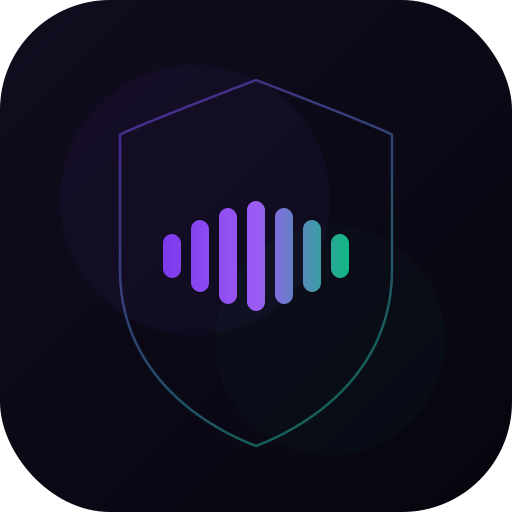

<div align="center">



# Pickr

### AI Call Screener

> An AI receptionist for your phone. It picks up unknown callers, screens them in real time, and lets you decide whether to take the call - all from a native Android app.

**Author:** Supreeth Ravi &nbsp;|&nbsp; **Branch:** `feat/pickr` &nbsp;|&nbsp; **Engine:** AVRS


</div>

---

## What is Pickr?

Spam calls, delivery agents, work calls, scams, that one relative who only calls during meetings - your phone has no idea which is which, so it rings for all of them.

Pickr puts an AI receptionist between the caller and you. When someone calls your Pickr number, the AI picks up, asks who's calling and why, transcribes the conversation live to your phone, and shows you a one-tap decision: **Join**, **Block**, or **Send a message** the AI will read out loud.

You see the call before it interrupts you. The caller talks to a calm, natural-sounding voice that responds in under a second. Nothing is recorded without you seeing it; everything is on your terms.

---

## How it works

```
   Someone calls your Pickr number
                │
                ▼
        ┌──────────────┐
        │ Exotel/Plivo │   PSTN / SIP carrier
        └──────┬───────┘
               │  WebSocket (audio in/out)
               ▼
   ┌───────────────────────┐    /ws/screen     ┌──────────────────┐
   │   Pickr Backend       │ ◄───────────────► │  Pickr Android   │
   │  (FastAPI + AVRS)     │   live transcript │      App         │
   │  STT → LLM → TTS      │   intent + action │   (Compose)      │
   └───────────────────────┘                    └──────────────────┘
```

1. Caller dials your assigned virtual number (Exotel or Plivo).
2. The carrier streams the call audio over WebSocket to the Pickr backend.
3. The backend runs **STT → Claude (screener persona) → TTS** through the AVRS three-tier renderer (corpus → cache → live TTS) so responses come back in tens to hundreds of milliseconds.
4. Every transcript chunk, intent (`spam | delivery | work | personal | emergency | unknown`), and action signal is broadcast to your Android app over `/ws/screen`.
5. You tap **Join** (AI says "please hold, connecting you"), **Block** (AI politely ends the call), or type a message the AI reads back to the caller.

---

## What users do

1. **Install the Pickr Android app** (`android/` in this repo).
2. **Grant permissions** - phone, contacts, notifications, overlay, "default call screener" role.
3. **Verify your number** with OTP. The backend assigns you a virtual number from the pool.
4. **Activate forwarding** - the app auto-dials the carrier code `**21*<assigned_number>#` so unknown calls forward to Pickr.
5. **Set your AI greeting** - "Hi, this is Maya, Supreeth's assistant. Who's calling?"
6. **Done.** From now on, unknown callers reach the AI first; your phone only rings when you choose to take the call.

Detailed onboarding flow is in [`docs/END_TO_END_SETUP.md`](docs/END_TO_END_SETUP.md).

---

## Why an AI receptionist works here

| Problem | What Pickr does |
|---|---|
| Spam/robocalls waste attention | AI screens before you ever see the call |
| You can't tell important from spam | INTENT is shown on screen as the caller speaks |
| Voicemail is dead | Real-time transcript + one-tap join is faster |
| TTS at scale is expensive and slow | AVRS engine routes 70-85% of audio to a prerecorded corpus and per-session cache |
| Latency over 1s sounds robotic | AVRS warm-cache turns render in single-digit milliseconds |

The AVRS engine ([details below](#engine-avrs)) is what makes the AI side of the conversation cheap and fast enough to do this for every incoming call.

---

## Components

### Backend (`avrs/`)

FastAPI app exposing:

- **Auth (OTP)** - `/v1/auth/otp/request`, `/v1/auth/otp/verify`, `/v1/auth/me`
- **Telephony bridges** - `/ws/exotel` (8 kHz PCM) and `/ws/plivo` (μ-law / L16)
- **App live monitor** - `/ws/screen?token=...` streams transcript + intent + action events
- **Plivo callbacks** - `/v1/plivo/answer`, `/v1/plivo/status`
- **Admin (X-API-Key)** - virtual number pool CRUD, user tier/enable/disable, usage analytics
- **Health & metrics** - `/health`, `/v1/metrics`, OpenAPI at `/docs`

Key modules:

| File | Purpose |
|---|---|
| `avrs/voice_api.py` | All HTTP + WebSocket routes |
| `avrs/users.py` | OTP, tiers (free/starter/pro/enterprise), virtual number pool, JSON persistence |
| `avrs/exotel.py` | Exotel Voicebot WebSocket bridge |
| `avrs/plivo.py` | Plivo AudioStream WebSocket bridge |
| `avrs/audio_utils.py` | Resample, energy VAD, PCM ↔ float32, μ-law codec |
| `avrs/agent.py` | Claude agent loop using the `screener` persona |
| `avrs/router.py` + `corpus.py` + `tts.py` + `merger.py` | AVRS three-tier render pipeline |

The `screener` persona is configured in [`agents.yaml`](agents.yaml). Its system prompt enforces a strict output format with `INTENT:` and `ACTION:` lines so the Android app can react deterministically.

### Android app (`android/`)

Native Kotlin + Jetpack Compose, package `ai.phronetic.screener`.

| Layer | Files |
|---|---|
| Services | `ScreenerService.kt`, `ScreeningWebSocketService.kt` |
| UI | `ui/MainActivity.kt`, `ui/ScreeningOverlayActivity.kt`, `ui/Components.kt` |
| Screens | `ui/screens/` - Dashboard, History, Contacts, Onboarding, Profile |
| ViewModels | `viewmodel/` - Contacts, History, Dashboard |
| Engines | `engine/` - `ScreeningEngine`, `LlmEngine`, `OfflineEngine` |
| Data | `data/db/` Room (`AppDatabase`, `ContactRule`, `ScreenedCallDao`), `data/repository/` |

Server URL lives in `android/app/src/main/java/ai/phronetic/screener/Config.kt` - point it at your backend before building.

---

## Setup

Two parts: the backend (with a telephony provider) and the Android app.

### 1. Backend

```bash
git clone <repo-url> && cd avrs
python3 -m venv .venv && source .venv/bin/activate
pip install -e ".[kokoro]"
python -m spacy download en_core_web_sm

# Models (~337MB, one-time)
bash scripts/download_models.sh

# Build the screener corpus
python scripts/build_insurance_corpus.py   # also picks up corpus_data/screener/

cp .env.example .env
# Required: ANTHROPIC_API_KEY
# Recommended: DEEPGRAM_API_KEY (fast cloud STT, ~200ms)
# Production: AVRS_API_KEY (gates admin endpoints - leave empty only for local dev)
# Telephony: PLIVO_AUTH_ID + PLIVO_AUTH_TOKEN  (or Exotel credentials)

uvicorn avrs.voice_api:app --host 0.0.0.0 --port 8000 --reload
```

Or use Docker (`docker compose up` after setting `.env` and running the `download-models` / `build-corpus` entrypoints).

### 2. Telephony provider

Pickr supports **Exotel** (Voicebot WebSocket) and **Plivo** (AudioStream). Plivo is the recommended path for Indian numbers.

- Provider account with at least one virtual number (Exophone or Plivo number).
- WebSocket URL pointed at your public backend:
  - Exotel: `wss://your-domain.com/ws/exotel`
  - Plivo: configured in the Plivo answer XML returned by `/v1/plivo/answer`
- Seed the number pool so onboarding can assign one to each user:

```bash
curl -X POST https://your-domain.com/v1/admin/numbers \
  -H "X-API-Key: $AVRS_API_KEY" -H "Content-Type: application/json" \
  -d '{"numbers":["+912261234567","+912261234568"], "region":"IN"}'
```

Full provider walkthroughs:

- [`docs/END_TO_END_SETUP.md`](docs/END_TO_END_SETUP.md) - Exotel
- [`docs/PLIVO_SETUP.md`](docs/PLIVO_SETUP.md) - Plivo

### 3. Android app

```bash
cd android
# Edit app/src/main/java/ai/phronetic/screener/Config.kt
#   const val SERVER_URL = "https://your-domain.com"

./gradlew :app:assembleDebug
adb install -r app/build/outputs/apk/debug/app-debug.apk
```

The first run guides you through permissions, OTP verification, number assignment, and call-forwarding activation.

---

## Project structure

```
avrs/
├── README.md                  # this file (Pickr)
├── STATUS.md                  # current snapshot of committed vs in-flight work
├── agents.yaml                # personas (insurance, banking, payments, screener)
├── .env.example
├── Dockerfile / docker-compose.yml / docker-entrypoint.sh
│
├── avrs/                      # backend (Pickr layer + AVRS engine)
│   ├── voice_api.py           # all HTTP + WebSocket routes
│   ├── users.py               # OTP, tiers, number pool
│   ├── exotel.py / plivo.py   # telephony bridges
│   ├── audio_utils.py         # PCM/μ-law/VAD helpers
│   ├── agent.py               # Claude tool-use loop
│   ├── parser.py corpus.py router.py tts.py stt.py merger.py metrics.py
│   └── server.py
│
├── android/                   # Pickr Android app (ai.phronetic.screener)
│   ├── app/src/main/java/ai/phronetic/screener/
│   │   ├── Config.kt
│   │   ├── ScreenerService.kt
│   │   ├── ScreeningWebSocketService.kt
│   │   ├── engine/  ui/  viewmodel/  data/
│   └── build.gradle.kts settings.gradle.kts gradlew
│
├── corpus_data/               # source phrase text files (per persona)
├── corpus/screener/           # generated screener WAVs + index.json
├── cache/                     # runtime synthesis cache (git-ignored)
├── models/kokoro/             # Kokoro ONNX (~337MB, git-ignored)
├── brand/                     # icon.svg, logo.svg
├── static/index.html          # AVRS browser demo (independent of Pickr)
│
├── scripts/                   # download_models.sh, build_*_corpus.py, find_best_questions.py
├── docs/
│   ├── END_TO_END_SETUP.md    # Pickr + Exotel + Android wiring
│   ├── PLIVO_SETUP.md         # Pickr + Plivo wiring
│   ├── AVRS_Pipeline_Technical.md / .pdf
│   └── AVRS_Research_Update.md / .pdf
└── tests/                     # pytest - covers AVRS core today
```

---

## Engine: AVRS

Pickr is built on **AVRS (Adaptive Voice Rendering System)** - a hybrid audio renderer that makes AI voice fast and cheap enough to put in front of every incoming call.

The trick: most of what an AI receptionist says is the same on every call. *"Hi, this is Maya. Who's calling?"* / *"One moment, let me check"* / *"Thanks, I'll let them know"*. AVRS prerecords those once, caches per-session synthesis on disk, and only sends genuinely novel text to live TTS.

```
LLM output:
  "Got it, {caller_name}. I'll let Supreeth know."
  SLOTS: {"caller_name": "Rahul"}

Renderer:
  "Got it, "                    → corpus  (~2ms)
  "Rahul"                       → live TTS (~840ms cold) / cache (~3ms warm)
  ". I'll let Supreeth know."   → corpus  (~2ms)
```

Three-tier routing per segment:

| Tier | Latency | Cost |
|---|---|---|
| 1. Corpus (prerecorded) | ~2 ms | $0 per call |
| 2. Session cache (disk) | ~3 ms | $0 per call |
| 3. Live TTS (Kokoro ONNX, CPU) | 200-840 ms | $0 per character (local) |

Measured on a 7-turn benchmark:

| Turn | Prerecorded | Cached | Live TTS | Total |
|---|---|---|---|---|
| Turn 1 (cold) | 33% | 16% | 51% | 1,470 ms |
| Turn 2 (warm) | 70% | 30% | 0% | **8 ms** |

For Pickr, this means the AI never sounds laggy on follow-up turns and the per-call cost is dominated by the LLM, not TTS.

Deeper reading:

- [`docs/AVRS_Pipeline_Technical.md`](docs/AVRS_Pipeline_Technical.md) - architecture and segment routing
- [`docs/AVRS_Research_Update.md`](docs/AVRS_Research_Update.md) - paper-style write-up

---

## Tech stack

| Layer | Technology |
|---|---|
| Backend | FastAPI + uvicorn |
| LLM | Claude (Anthropic) with tool use |
| STT | Deepgram nova-2 (cloud) / faster-whisper (offline) |
| TTS | Kokoro ONNX - 82M params, CPU only |
| Telephony | Exotel Voicebot, Plivo AudioStream |
| Persistence | JSON files today (Postgres + Redis is the planned next step) |
| Android | Kotlin, Jetpack Compose, Room, OkHttp WebSockets |

---

## Status

See [`STATUS.md`](STATUS.md) for an up-to-date snapshot of what's committed on this branch vs in-flight, known gaps (no tests yet for the Pickr backend layer, JSON persistence is MVP-grade), and suggested next moves.

---

## Quick reference

| Endpoint | Purpose |
|---|---|
| `GET /health` | Liveness + agent/user/pool counts |
| `POST /v1/auth/otp/request` | Send OTP to a phone number |
| `POST /v1/auth/otp/verify` | Verify OTP, get token + assigned virtual number |
| `GET/PATCH /v1/auth/me` | User profile (greeting, name) |
| `WS /ws/exotel` | Exotel Voicebot bridge |
| `WS /ws/plivo` | Plivo AudioStream bridge |
| `WS /ws/screen?token=...` | Live transcript + intent stream for the Android app |
| `POST /v1/admin/numbers` | Seed the virtual number pool (X-API-Key) |
| `GET /v1/admin/users` | List users (X-API-Key) |
| `GET /v1/admin/analytics` | Usage analytics (X-API-Key) |

---

## Tests

```bash
pytest tests/
```

Covers the AVRS core (`parser`, `merger`, `router`, `metrics`). The Pickr layer (`users.py`, `exotel.py`, `plivo.py`, `audio_utils.py`, voice_api auth/admin) does not yet have tests - tracked in `STATUS.md`.
